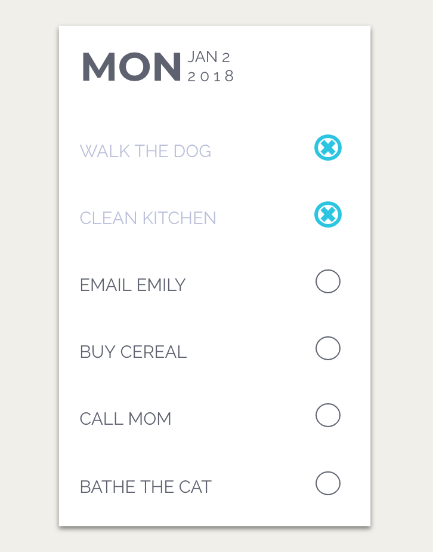

# Homework for Unit 13 - To Do List App with Socket.io

For the main part of this week's homework, you're going to be creating a realtime to do list application using Socket.io and Mongo as the database.

Use this image as your UI guide.

When you add or delete a to do entry it should automatically appear or disapear in every window or tab in which the to do list application is open.

Your application must be deployed to Heroku with Mongo. Submit a Github and Heroku link to BCS.